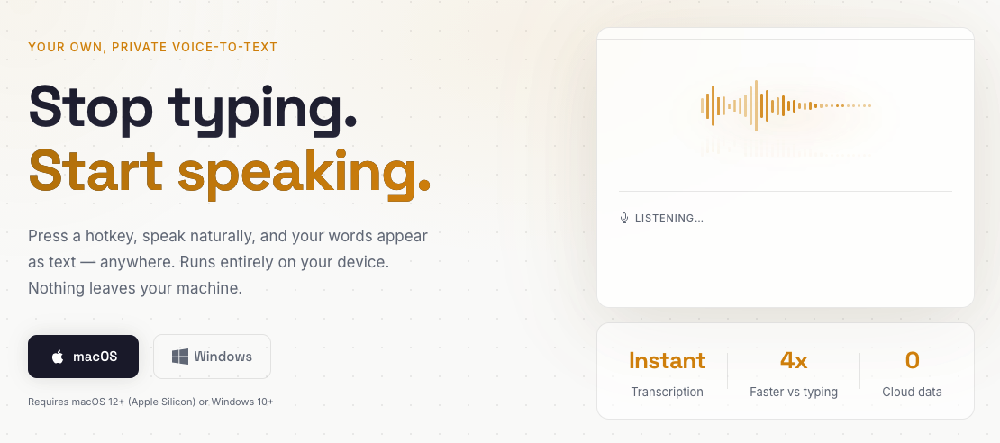

# AudioShift

Local voice-to-text transcription for your desktop. Press a shortcut, speak, and your words appear as text — all processed on your device.

No accounts. No subscriptions. No cloud.



**[Download](https://github.com/aarsla/audioshift/releases)** | **[Mac App Store](https://apps.apple.com/us/app/audioshift/id6759166457)** | **[Website](https://audioshift.io)**

## Features

- **Global hotkey** — trigger recording from any app with `Option+Space` on Mac / `Ctrl+Space` on Windows (customizable)
- **Multiple speech models** — choose the best model for your needs:

  | Model | Engine | Languages | Size |
  |-------|--------|-----------|------|
  | Parakeet TDT 0.6B v3 | Parakeet | English | ~680 MB |
  | Whisper Large v3 Turbo (Q5) | Whisper | 100+ languages | ~574 MB |
  | Whisper Large v3 Turbo (Q8) | Whisper | 100+ languages | ~874 MB |
  | Whisper Medium (Q5) | Whisper | 100+ languages | ~539 MB |
  | Whisper Small (Q5) | Whisper | 100+ languages | ~190 MB |

- **Auto-paste** — transcribed text is inserted directly into the active application
- **Multilingual support** — Whisper models support 100+ languages with optional translate-to-English
- **Transcription history** — searchable history with app context, audio recordings, and transcripts saved to `~/Documents/AudioShift`
- **Recording overlay** — four visual themes with real-time waveform visualization
- **Customizable** — themes (light/dark/system), accent colors, overlay position, start sounds
- **Auto-updates** — built-in updater for direct downloads (Mac App Store updates via the store)

## Privacy

AudioShift processes everything locally. Zero network calls during transcription, no API keys, no audio leaves your device. The speech model is downloaded once on first launch and runs offline from that point.

## Platforms

| Platform | Version | Architecture | Distribution |
|----------|---------|-------------|--------------|
| macOS | 12+ | Apple Silicon | DMG, Mac App Store |
| Windows | 10+ | x86_64 | NSIS installer |

## Installation

### macOS (Direct Download)

Download the `.dmg` from the [releases page](https://github.com/aarsla/audioshift/releases). The app is signed and notarized.

Two permissions are required:
- **Microphone** — to capture audio for transcription
- **Accessibility** — to paste transcribed text into the active application

You'll be prompted on first use. Manage in **System Settings > Privacy & Security**.

### macOS (App Store)

Install from the [Mac App Store](https://apps.apple.com/us/app/audioshift/id6759166457). Permissions are the same as above.

### Windows

Download the `.exe` installer from the [releases page](https://github.com/aarsla/audioshift/releases).

**Important:** The Windows build is not code-signed. Windows will show a SmartScreen warning on first launch:

1. Click **"More info"** on the SmartScreen dialog
2. Click **"Run anyway"**

If the installer is blocked entirely, you may need to temporarily adjust: **Settings > Privacy & Security > Windows Security > App & browser control > Smart App Control** — set to **Off** or **Warn**.

## Development

### Prerequisites

- [Rust](https://rustup.rs/) (latest stable)
- [Node.js](https://nodejs.org/) 18+
- [pnpm](https://pnpm.io/)

### Make Targets

```bash
make dev          # Dev mode with hot reload
make build        # Production build (direct distribution)
make build-mas    # Mac App Store build (.app, aarch64)
make check        # Rust type check (direct)
make check-mas    # Rust type check (MAS)
make check-ts     # TypeScript type check
make check-all    # All checks (Rust direct + MAS + TypeScript)
make clean-dev    # Reset permissions, settings, history and restart dev
make run          # Build, reset, and open production .app
make pkg          # Build, sign, and package for App Store submission
```

> **Note:** `cargo check` alone won't work — use `make check` which sets the required Tauri env vars.

### Stack

- **Frontend:** React 19, TypeScript, Vite 7, Tailwind CSS 4, shadcn/ui
- **Backend:** Tauri 2, cpal (audio capture), parakeet-rs + whisper-rs (transcription), tokio
- **Plugins:** global-shortcut, store, autostart, updater, process, opener

## License

MIT
